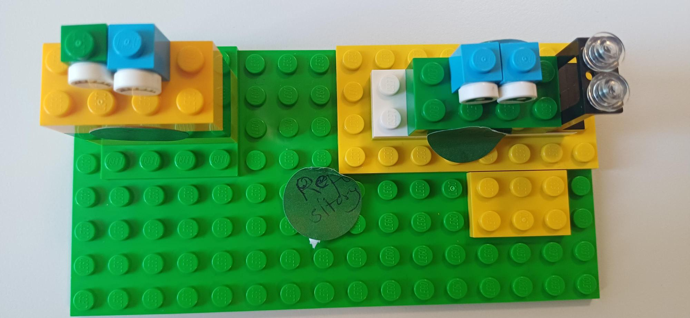
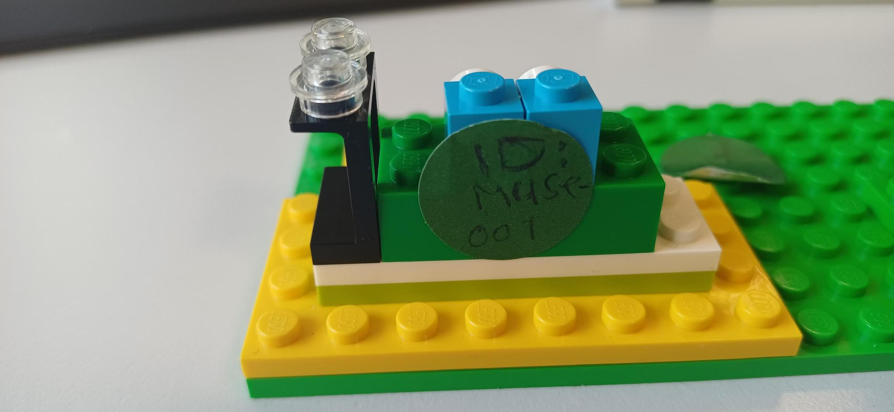
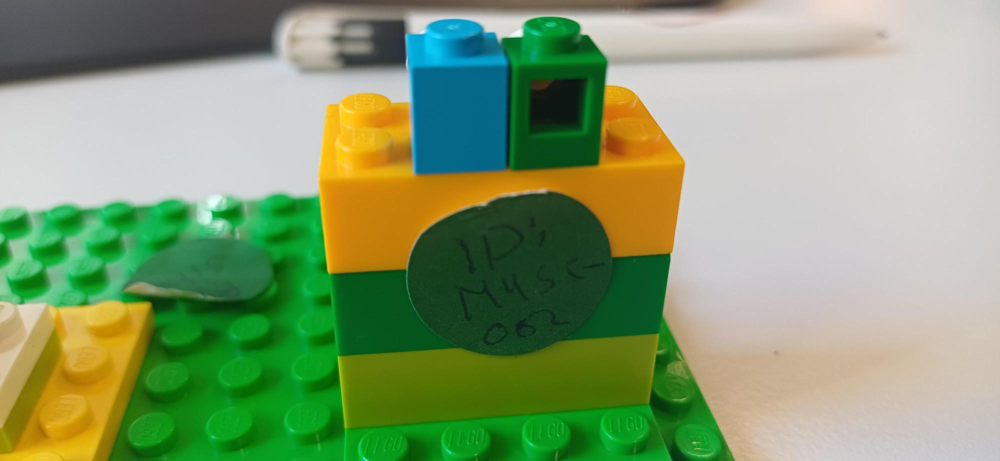
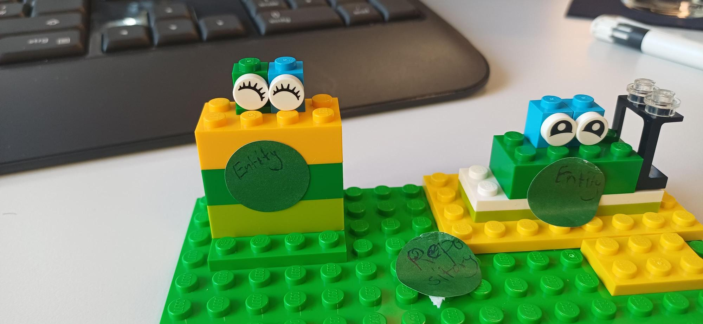

# 🏛️ Neustadt Museum: Data Foundation Prototype

A professional Python-based management system for the Neustadt Museum, establishing a standardized environment through **Clean Architecture**, **Domain-Driven Design (DDD)**, and **Functional Programming**.

---

## 🏗️ Methodology: 20% Analog / 80% Digital

### 🧱 Analog Domain Modeling (20%)
To fulfill the **Ganzheitliche Aufgabe** requirements, we visualized the domain logic using **LEGO Classic 10696**. This physical modeling helped us define core architectural boundaries:

1. **The Repository & Data Foundation:** Establishing the baseplate as the memory space.
   

2. **Entity Identity (K3):** Using "Eyes" to represent unique exhibits. Each entity is assigned a unique identifier to represent its identity in the system.
   

3. **Collection Scaling:** Modeling how multiple entities (MUSE-002, MUSE-003) are organized within the repository.
   
   

### 💻 Digital Engineering (80%)
* **Repository Pattern:** Decouples domain logic from JSON storage, ensuring the system is technology-agnostic.
* **Functional Pipeline:** Advanced filtering and data analytics (Map-Reduce) using `lambda` and `filter` for side-effect-free operations.
* **Strict Modeling:** Separation of **Entities** (Exhibit) and **Value Objects** (Dimensions).

---

## 🚀 Key Features & Paradigms

* **Advanced Query Engine:** Dynamic search using functional lambda expressions to filter exhibits by year, artist, or type.
* **Data Analytics:** Implementation of the Map-Reduce pattern to calculate museum metrics, such as the average age of the collection.
* **Quality Assurance:** Integrated Unit Testing suite to ensure identity integrity and data validation.
* **Dev-Ops Standards:** Professional `.gitignore` configuration for environment isolation and atomic Git commits.

---

## 🔍 Technical Analysis (K4)

### Data Format Comparison
After evaluating **JSON, XML, and YAML** for museum archiving:
* **JSON (Selected):** Best for its lightweight structure and native compatibility with Python dictionaries.
* **XML:** Rejected due to high verbosity and complexity for this specific use case.
* **YAML:** Excellent for configuration but less efficient for large data object reconstruction.

---

## 📂 Project Structure
* `LF5_3_models.py`: Domain Layer (Entities & Value Objects).
* `LF5_3_repository.py`: Infrastructure Layer (Persistence & Functional Logic).
* `LF5_3_main.py`: Application Layer (Orchestrator).
* `test_suite.py`: Quality Assurance (Unit Tests).
* `exhibits.json`: Data Storage.

---

## 💻 How to Run

### 1. Start the Application
```bash
python LF5_3_main.py
python test_suite.py
